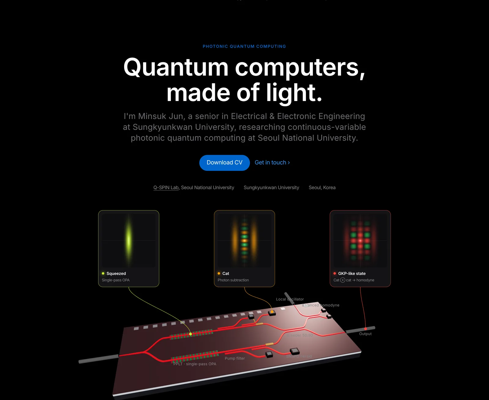
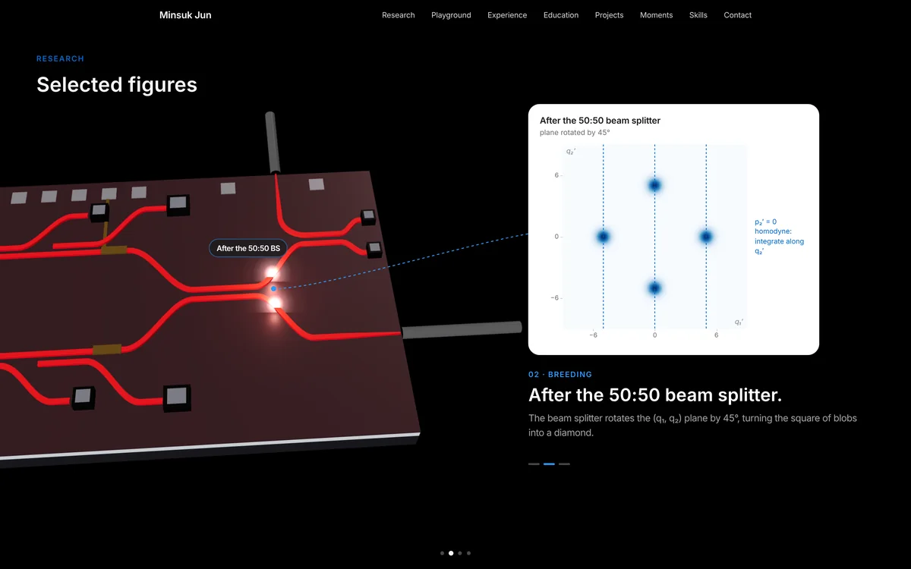
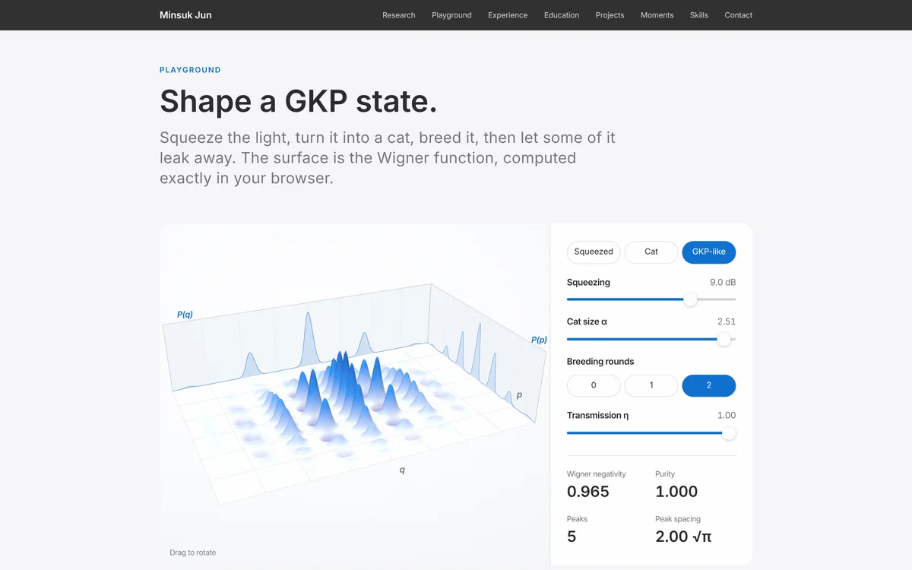

# minsukjun.com

Personal website of **Minsuk Jun**, an undergraduate in Electrical and Electronic Engineering at Sungkyunkwan University and a research intern at the [Q-SPIN Lab](https://donguknam.com/), Seoul National University. I work on continuous-variable photonic quantum computing: GKP state generation by cat state breeding on thin-film lithium tantalate (LTOI) chips, and the loss budget each on-chip component has to meet.

**Live site: [minsukjun.com](https://minsukjun.com)**



## What is on the site

| | |
|---|---|
|  |  |
| **Selected figures.** A pinned scroll story on the chip: phase space, the breeding step at the beam splitter and homodyne detector, and where light is lost. | **Wigner Playground.** A 3D Wigner function you can rotate, with squeezing, cat amplitude, loss and breeding rounds as live controls. |

- **Hero**: a three.js model of the chip. A pump drives single-pass squeezing in periodically poled LT (PPLT), photon subtraction heralds cat states, two cats meet on a 50:50 beam splitter and a balanced homodyne detector (with its own local oscillator) heralds the bred output.
- **Selected figures**: every plot is computed in the browser from closed-form expressions and drawn at the screen's own pixel density, so it stays sharp on any display.
- **Wigner Playground**: exact Wigner functions of squeezed cats as sums of Gaussians, with ideal breeding and a pure-loss channel. Checked against brute-force numerics to about 1e-4.
- **Experience, Education, Projects, Skills**, and a downloadable CV.
- **Moments**: a small photo gallery, encrypted (AES-GCM, key derived with PBKDF2) and unlocked in the browser.
- **Guestbook**: notes are held for approval before they appear, and visitors can choose to leave a private note.

## How it is built

Hand-written HTML, CSS and JavaScript with no build step, served by GitHub Pages.

| Part | Tools |
|---|---|
| 3D chip and scroll story | [three.js](https://threejs.org/) r149 |
| Figures and playground | Canvas 2D and SVG, physics in `js/wigner-core.js` |
| Guestbook API | Cloudflare Workers, D1, Turnstile |
| Gallery | Web Crypto API (PBKDF2-SHA256, AES-GCM-256) |
| Domain and DNS | Cloudflare |

```
index.html            the whole page (markup and styles)
js/hero.js            3D chip, pulses, scroll story and call-outs
js/wigner-core.js     exact Wigner functions, breeding and loss
js/wfig.js            figure 01, phase space
js/figures.js         figures 02 and 03, breeding and loss
js/playground.js      Wigner Playground
js/moments.js         gallery and its unlock form
js/guestbook.js       guestbook client
_guestbook-worker/    Cloudflare Worker source (not published)
img/                  logos, photos and encrypted gallery files
```

## Run it locally

```bash
git clone https://github.com/minsukjun/minsukjun.github.io.git
cd minsukjun.github.io
python3 -m http.server 8000
```

Then open http://localhost:8000.

## Contact

[LinkedIn](https://www.linkedin.com/in/minsuk-jun) · [GitHub](https://github.com/minsukjun)

© 2026 Minsuk Jun. The code may be read for reference; the text, figures and photos may not be reused without permission.
